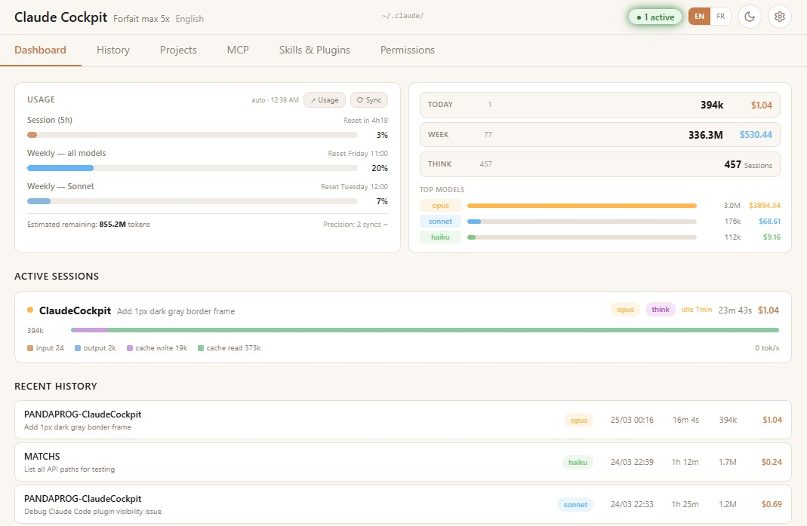
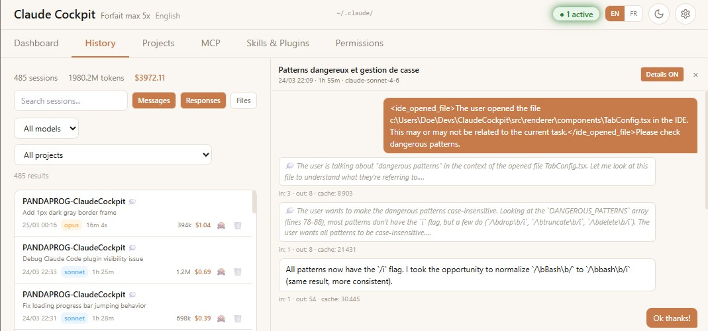
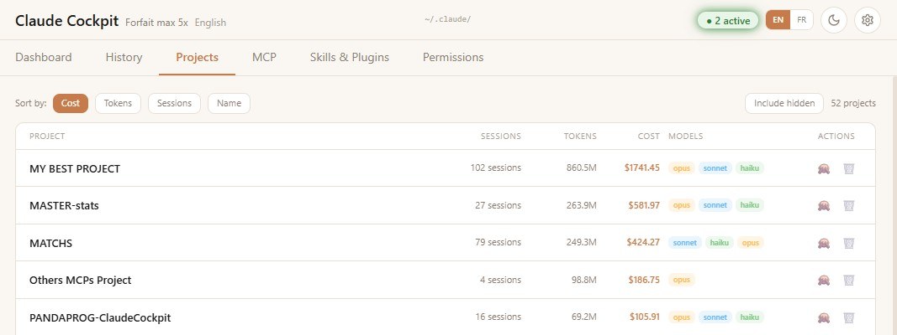
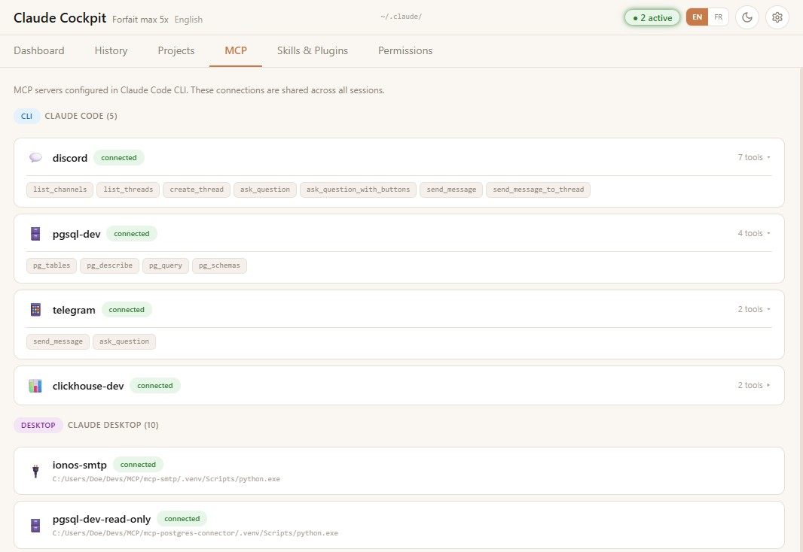
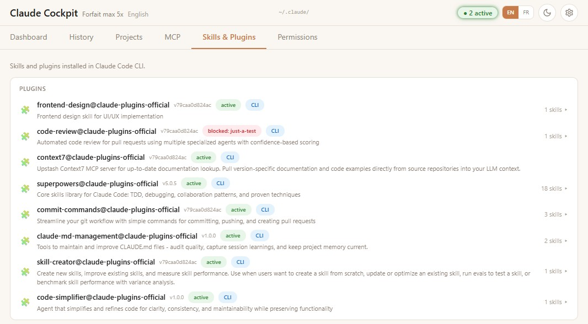
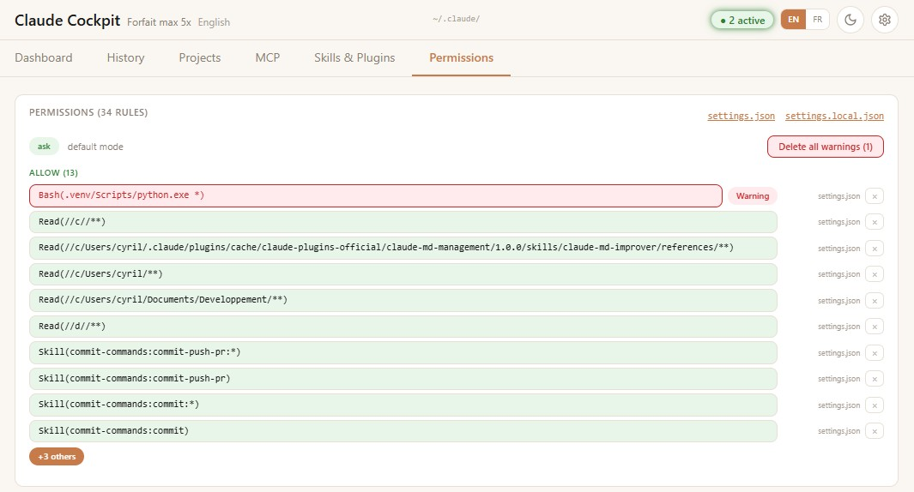
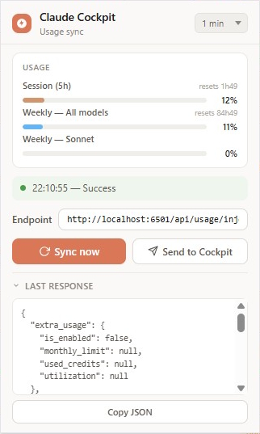
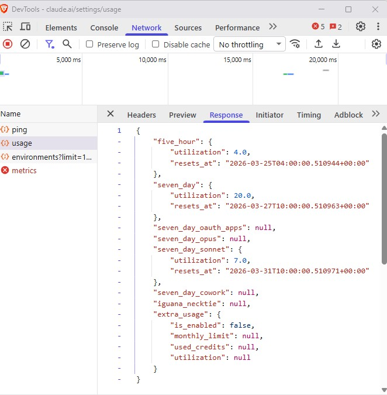
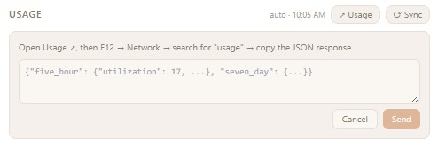

<div align="center">

# Claude Cockpit

[](LICENSE)
[](docker-compose.yml)
[](#requirements)

**Personal dashboard to monitor your Claude Code CLI sessions, API usage, and costs in real time.**

🔑 **No API key required** — usage data is synced from your browser, not from the Anthropic API.

[Features](#features) · [Quick Start](#quick-start) · [Usage Sync](#usage-sync) · [API](#api)

</div>

---

<p align="center">
  
</p>

## Features

| Feature | Description |
|---------|-------------|
| 🖥️ **Real-time dashboard** | Usage bars, active sessions, stats via SSE |
| 📜 **Session history** | Filterable, sortable, full-text search, side-panel viewer |
| 📁 **Projects** | Per-project session breakdown |
| ⚙️ **Config viewer** | MCP servers, plugins, skills, permissions |
| 🔄 **Usage sync** | Chrome extension (auto) or manual paste |
| 💰 **Cost estimation** | Per-model pricing (Opus, Sonnet, Haiku) |
| 🎯 **Calibration** | Remaining tokens estimated from usage % |
| 🌗 **Dark / Light theme** | System-aware |

## Screenshots

##### Session History
<p align="center">
  
</p>

##### Projects
<p align="center">
  
</p>

##### MCP Servers
<p align="center">
  
</p>

##### Skills & Plugins
<p align="center">
  
</p>

##### Permissions
<p align="center">
  
</p>

##### Chrome Extension
<p align="center">
  
</p>

## Stack

| Layer | Tech |
|-------|------|
| Frontend | React, Vite |
| Backend | Node.js, Express |
| Data | `~/.claude/` session files (read/write) |
| Infra | Docker Compose, Chrome Extension |

## Requirements

- **Claude Code CLI** — installed and used at least once (`~/.claude/` must exist)
- **Docker** — for containerized install ([Docker Desktop](https://www.docker.com/products/docker-desktop/))
- **Node.js 22+** — for local install only

## Quick Start

### Docker (recommended)


- `~/.claude/` is mounted read/write (sessions and permissions can be deleted from the dashboard)
- App data is persisted in a Docker volume
- Automatically restarts on reboot


```bash
git clone https://github.com/PandaProgParis/ClaudeCockpit.git
cd ClaudeCockpit
docker compose up -d
```


→ Open **http://localhost:6501**

### Local

```bash
git clone https://github.com/PandaProgParis/ClaudeCockpit.git
cd ClaudeCockpit
npm install
npm run dev          # dev mode → http://localhost:5200
```

Production build:

```bash
npm start            # build + serve → http://localhost:3001
```

## Usage Sync

Claude Cockpit needs your claude.ai usage data to display costs and limits. There are **2 ways** to feed it — pick whichever suits you.

### Option 1 — Manual paste (no install needed)

1. Open `claude.ai/settings/usage` in your browser
2. Open DevTools (`F12`) → **Network** tab
3. Look for the API request returning your usage JSON (e.g. `/api/usage`)
4. Copy the response body
5. Paste it into Cockpit via **Settings → Manual Usage Paste**, or POST it directly:
6. (Or use POST to send json)

```bash
curl -X POST http://localhost:3001/api/usage/manual -H "Content-Type: application/json" -d @usage.json
```

<p align="center">
  
  
</p>

### Option 2 — Chrome Extension (automatic)

Automates the manual process above. Every (1 to 15) minutes, the extension opens a minimized window to `claude.ai/settings/usage`, intercepts the usage API response, and posts it to Cockpit automatically.

**Install:**

1. `npm run package:extension` → outputs `dist/claudecockpit-extension.zip`
2. `chrome://extensions` → enable **Developer mode**
3. **Load unpacked** → select `dist/extension/`
4. You can change Endpoint port **3001** (local) or **6501** (Docker)

<p align="center">
  
</p>

> ⚠️ You must be logged in to claude.ai in Chrome for the extension to work.


## API

The backend API is a local bridge between the Cockpit frontend and your `~/.claude/` directory — it reads, parses, and serves session data. No external calls, no cloud, everything stays on your machine.

All endpoints are served on port **3001** (local) or **6501** (Docker).

<details>
<summary><strong>Full endpoint reference</strong></summary>

### Dashboard & Stats

| Endpoint | Method | Description |
|----------|--------|-------------|
| `/api/stats` | GET | Aggregated global stats |
| `/api/events` | GET | SSE stream (session + usage events) |
| `/api/active` | GET | Currently active sessions |
| `/api/calibration` | GET | Token-per-percent calibration data |

### Sessions

| Endpoint | Method | Description |
|----------|--------|-------------|
| `/api/history` | GET | Cached sessions (excludes hidden) |
| `/api/history/refresh` | GET | Re-parse `~/.claude/` files |
| `/api/search` | GET | Full-text search across session messages |
| `/api/sessions/:id/messages` | GET | Messages for a specific session |
| `/api/sessions/:id/hide` | POST | Hide a session |
| `/api/sessions/:id/unhide` | POST | Unhide a session |
| `/api/sessions/:id` | DELETE | Delete a session |
| `/api/sessions/hidden` | GET | List hidden session IDs |

### Usage

| Endpoint | Method | Description |
|----------|--------|-------------|
| `/api/usage` | GET | Current usage (API with cache fallback) |
| `/api/usage/manual` | POST | Submit usage JSON manually |
| `/api/usage/inject` | POST | Receive usage data from Chrome extension |

### Config & Settings

| Endpoint | Method | Description |
|----------|--------|-------------|
| `/api/config` | GET | Claude CLI config (plugins, MCP, permissions) |
| `/api/file-content` | GET | Read skill/plugin file content |
| `/api/permissions` | DELETE | Remove a permission rule |
| `/api/open-file` | POST | Open a file in the system editor |
| `/api/settings` | GET / POST | Read/write app settings |
| `/api/prices` | GET / POST | Read/write custom model prices |

</details>

## License

[MIT](LICENSE)